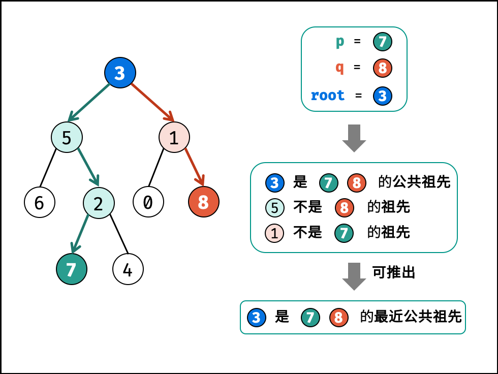

###  二叉树的最近公共祖先(2)

> 题目:给定一个二叉搜索树, 找到该树中两个指定节点的最近公共祖先。

[百度百科](https://baike.baidu.com/item/%E6%9C%80%E8%BF%91%E5%85%AC%E5%85%B1%E7%A5%96%E5%85%88/8918834?fr=aladdin)中最近公共祖先的定义为：“对于有根树 T 的两个结点 p、q，最近公共祖先表示为一个结点 x，满足 x 是 p、q 的祖先且 x 的深度尽可能大（一个节点也可以是它自己的祖先）。”

例如，给定如下二叉树:  root = [3,5,1,6,2,0,8,null,null,7,4]


示例 1：

```js
// 输入: root = [3,5,1,6,2,0,8,null,null,7,4], p = 5, q = 1
// 输出: 3
// 解释: 节点 5 和节点 1 的最近公共祖先是节点 3。
```

示例 2：

```js
// 输入: root = [3,5,1,6,2,0,8,null,null,7,4], p = 5, q = 4
// 输出: 5
// 解释: 节点 5 和节点 4 的最近公共祖先是节点 5。因为根据定义最近公共祖先节点可以为节点本身。
```

说明:

* 所有节点的值都是唯一的。
* p、q 为不同节点且均存在于给定的树中。

> 注意：本题与[主站 236 题](https://leetcode-cn.com/problems/lowest-common-ancestor-of-a-binary-tree/)相同。

### 思路分析

本题与[二叉搜索树的最近公共祖先-1](/codes/1/lowestCommonAncestor-1.md)相似。区别在于满足题意的示例二叉树节点不同。根据前者，我们可以得知如下定义:

若节点p在节点root的左（右）子树，或节点p = root节点，则称root节点是p节点的祖先。如下图所示:


而最近公共祖先节点的定义为:

设节点root为节点p,q的某公共祖先节点，若其子左节点root.left和右子节点root.right都不是节点p,q的公共祖先节点，则称root节点为节点p,q的最近公共祖先节点。

根据以上的定义，若root节点为节点p,q的最近公共祖先节点，只可能为以下几种情况之一:

1. p节点 和 q节点 在root节点的子树中，且分别在root节点的异侧（即分别在左子树和右子树中）。

2. p = root,且q节点在root节点的左或右子树中。

3. q = root,且p节点在root节点的左或右子树中。

如下图所示:



回顾一下[重建二叉树](/codes/1/buildTree.md)，我们知道遍历二叉树有3种遍历，即前序遍历（先序遍历）、中序遍历、后序遍历。观察发现，这里使用先序遍历来进行递归，遇到节点p、q的时候则返回。然后再从底至顶回溯，当节点p、q在root的异侧时，root节点即为二叉树的最近公共祖先节点。因此直接向上返回root节点即可。具体算法流程如下:

- 1. 递归终止条件:
    - 1.1 当越过叶子节点时，直接返回null。
    - 1.2 当root等于p、q时，直接返回root。
- 2. 递归：
    - 2.1 开启递归左子节点，返回值记为left。
    - 2.2 开启递归右子节点，返回值记为right。
- 3. 返回值，根据left和right，可以展开为4种情况:
    - 3.1 当left和right同时为空，说明root节点的左右子树都不包含p、q节点，返回null。
    - 3.2 当left和right同时不为空，说明p、q节点分列在root节点的异侧（即左右子树中），因此root节点为p、q节点的最近公共祖先节点，返回root。
    - 3.3 当left为空，right不为空:p、q节点都不在root节点的左子树中，可分为以下两种情况:
      - 3.3.1 p、q节点有一个在root节点的右子树中，此时right指向p（或q）节点（哪一个节点在root的右子树中，就指向哪一个节点）。
      - 3.3.2 p、q节点都在root节点的右子树中，此时right指向最近的公共祖先节点。
- 4. 当left不为空，right为空时，分析同第3点。

代码如下:

```js
/**
 * Definition for a binary tree node.
 * function TreeNode(val) {
 *     this.val = val;
 *     this.left = this.right = null;
 * }
 */
/**
 * @param {TreeNode} root
 * @param {TreeNode} p
 * @param {TreeNode} q
 * @return {TreeNode}
 */
var lowestCommonAncestor = function(root,p,q) {
    if(root === null || root === p || root === q){
        return root;
    }
    let left = lowestCommonAncestor(root.left,p,q),
        right = lowestCommonAncestor(root.right,p,q);
    // 第1点left和right都为null的情况
    if(left === null && right === null){
        return null;
    }
    // 第3点left为null，right不为null的情况
    if(left === null){
        return right;
    }
    // 第4点，left不为null，right为null的情况
    if(right === null){
        return left;
    }
    // 第2点left和right都不为null的情况
    return root;
};
```

* 时间复杂度 O(n)： 其中 n 为二叉树节点数；最差情况下，需要递归遍历树的所有节点。
* 空间复杂度 O(n)： 最差情况下，递归深度达到 n ，系统使用 O(n) 大小的额外空间。

事实上，我们在递归分析的同时，还可以将第1点的分析合并到第3点和第4点的分析中。所以以上代码我们可以修改如下:

```js
/**
 * Definition for a binary tree node.
 * function TreeNode(val) {
 *     this.val = val;
 *     this.left = this.right = null;
 * }
 */
/**
 * @param {TreeNode} root
 * @param {TreeNode} p
 * @param {TreeNode} q
 * @return {TreeNode}
 */
var lowestCommonAncestor = function(root,p,q) {
    if(root === null || root === p || root === q){
        return root;
    }
    let left = lowestCommonAncestor(root.left,p,q),
        right = lowestCommonAncestor(root.right,p,q);
    if(left === null){
        return right;
    }
    if(right === null){
        return left;
    }
    return root;
};
```

本质上，[深度优先搜索(DFS算法)](https://baike.baidu.com/item/%E6%B7%B1%E5%BA%A6%E4%BC%98%E5%85%88%E6%90%9C%E7%B4%A2/5224976?fromtitle=DFS&fromid=5055&fr=aladdin)中的递归也可以解决本题。在使用深度优先搜索算法之前，我们需要找到满足最近公共祖先节点的条件。即:

1. left && right 即left和right同时存在时。
2. (left || right) && (root === p || root = q)即left和right有一个存在，并且root节点等于p或者q节点时。

根据以上分析，我们可以写出如下代码:

```js
/**
 * Definition for a binary tree node.
 * function TreeNode(val) {
 *     this.val = val;
 *     this.left = this.right = null;
 * }
 */
/**
 * @param {TreeNode} root
 * @param {TreeNode} p
 * @param {TreeNode} q
 * @return {TreeNode}
 */
var lowestCommonAncestor = function(root,p,q) {
    let x;
    const DFS = function(node){
        if(node === null){
            return false;
        }
        const left = DFS(node.left),
              right = DFS(node.right);
        if((left && right) || (node === p || node === q) && (left || right)){
            x = node;
        }
        return left || right || (node === p || node === q);
    }
    DFS(root);
    return x;
};
```

[更多思路](https://leetcode-cn.com/problems/er-cha-shu-de-zui-jin-gong-gong-zu-xian-lcof/solution/mian-shi-ti-68-ii-er-cha-shu-de-zui-jin-gong-gon-7/)。
