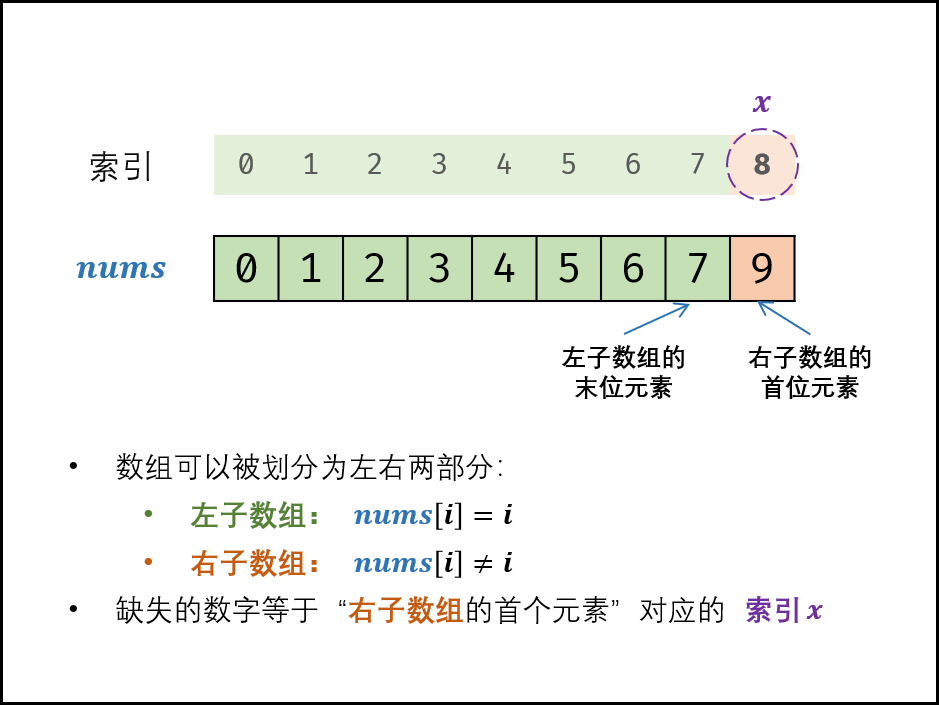

### 0  ~  n-1中缺失的数字

> 题目:一个长度为n-1的递增排序数组中的所有数字都是唯一的，并且每个数字都在范围0 ~ n-1之内。在范围0 ~ n-1内的n个数字中有且只有一个数字不在该数组中，请找出这个数字。

示例1:


```js
// 输入: [0,1,3]
// 输出: 2
```

示例2:


```js
// 输入: [0,1,2,3,4,5,6,7,9]
// 输出: 8
```

限制:

* 1 <= 数组长度 <= 10000

### 思路分析

本题的难度不大，首先我们应该想到的就是暴力循环。因为数组的所有数字都是从0开始并且递增的，因此我们可以循环这个数组，判断如果索引值与对应的数组项不相同，则代表这个数字不在该数组中，因此直接跳出循环，返回这个索引值即可。如下所示:

```js
var missingNumber = function(nums){
    let res;
    for(let i = 0,l = nums.length;i < l;i++){
        if(i !== nums[i]){
            res = i;
            break;
        }
    }
    return res;   
}
```

但是我们肯定知道还有更加好的方法来代替暴力循环。那么我们应该采用什么方法呢？

我们来分析题意。首先我们可以将数组划分成2个部分。如下所示:

1. 左子数组:nums[i] === i。
2. 右子数组:nums[i] !== i。

因此，右子数组的首位元素即是缺失的数字。在这里，我们就可以考虑二分法来解决本题。二分法分析如下图所示:



二分法算法流程如下:

1. 首先定义2个指针变量分别代表2个边界，即左边界i = 0,右边界j = nums.length - 1。其实也就是遍历的条件为闭区间[i,j]。
2. 循环二分:当i <=j 时开始循环，也就是说闭区间[i,j]为空时，我们就跳出循环。

    2.1 计算中点m = Math.floor(i + j)。

    2.2 如果nums[m] === m,则代表左子数组一定不包含缺失的数字（也就是右子数组的首位元素一定在闭区间[m + 1,j]中），因此改变左边界i = m + 1。

    2.3 如果nums[m] !== m,则代表左子数组的末位元素一定在闭区间[i,m - 1]中，因此 执行j = m - 1。

3. 返回值: 跳出时，对应的变量i和j就分别对应右子数组首位元素和左子数组末位元素，因此返回变量i即可。


```js
var missingNumber = function(nums){
    let i = 0,j = nums.length - 1;
    while(i <= j){
        let m = Math.floor((i + j) / 2);
        // 相等则改变左边界
        if(nums[m] === m){
            i = m + 1;
        }else {
            j = m - 1;
        }
    }
    // 返回i变量
    return i;
}

```

时间复杂度O(log<sup>n</sup>)：二分法为对数级别复杂度。
空间复杂度O(1)：几个变量使用常数大小的额外空间。

更多详细解题思路参考[题解](https://leetcode-cn.com/problems/que-shi-de-shu-zi-lcof/solution/mian-shi-ti-53-ii-0n-1zhong-que-shi-de-shu-zi-er-f/)。

