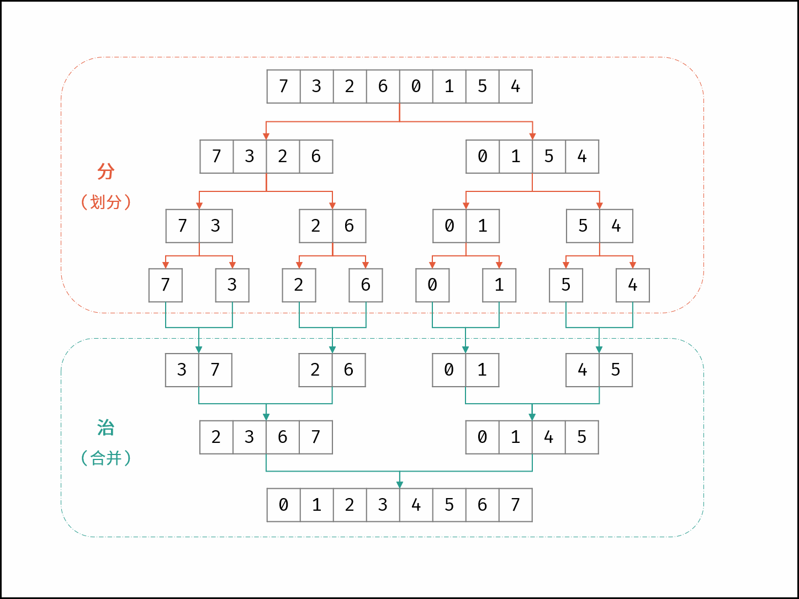

### 数组中的逆序对

> 题目:在数组中的两个数字，如果前面一个数字大于后面的数字，则这两个数字组成一个逆序对。输入一个数组，求出这个数组中的逆序对的总数。

示例1:

```js
// 输入: [7,5,6,4]
// 输出: 5
```

限制:

* 0 <= 数组长度 <= 50000

### 思路分析

直观来看，本题可以直接使用暴力循环法来解决。但是我们知道如果使用循环，那么必定是要嵌套的，而且题目给定的数组长度是0 <= 数组长度 <= 50000,因此时间复杂度O(n<sup>2</sup>)是不符合题意的。因此我们需要想其它的算法来解决。那么我们应该如何来做这道题呢？

观察逆序对的定义，我们可以很快的得到一个规律，那就是逆序对是与归并排序算法息息相关的。比如我们来看两个特例。

1. [1,2,3,4,5,6,7],这是一个升序数组，根据逆序对的定义，我们可以得知这个数组的逆序对数是0。因为在这个数组当中，没有任何一个数字大于它后面的数字。
2. [7,6,5,4,3,2,1],这是一个降序数组，根据逆序对的定义，我们可以得知这个数组的逆序对数。如下所示:

    2.1. 7与6,7与5,7与4...7与1，因此逆序对数为6。

    2.2. 6与5,6与4,...6与1，因此逆序对数为5。

    2.3 ...
    
依次类推，我们可以得到该数组的逆序对数为6 + 5 + 4 + 3 + 2 + 1 = 21。

在降序的过程中，我们可以知道归并排序的思想，也就是"分而治之"。那么如何理解分与治呢？

* 分：不断将数组从中间点划分开，因此整个数组的排序问题就变成了子数组排序问题。
* 治: 划分的子数组长度为1时，开始向上合并，不断将较短排序数组合并为较长排序数组，直到合并至原数组时完成排序。

这段文字可能不好理解，我们看如下图所示:

> 下图展示了数组[7,6,5,4,3,2,1]的归并排序算法过程。



根据上图，我们可以得知，在合并阶段（也就是治的阶段），也就是两个排序数组合并的过程中，每当遇到左子数组的当前元素大于右子数组的当前元素，则代表左子数组的元素到左子数组的最后一个元素都与右子数组当前元素构成了逆序对。比如我们拿第一个左子数组[3,7]和第一个右子数组[2,6]做比较。

* 左子数组当前元素为3、右子数组当前元素为2的时候，3 > 2，则代表左子数组的所有元素，即3和7都与右子数组的元素2构成逆序对，这里的逆序对数就为2。
* 左子数组当前元素为3，右子数组当前元素为6的时候，无可比较，逆序对为0。
* 左子数组当前元素为7，右子数组当前元素为2的时候，第一种情况已经分析包含了，所以不计算逆序对数。
* 左子数组当前元素为7，右子数组当前元素为6的时候，逆序对为1。

事实上，我们在考虑计算逆序对的时候，应该是在第三阶段到第四阶段之间，也就是2个包含4个元素的数组组成归并排序后的数组的时候，此时通过创建2个指针来去遍历每一个元素，然后计算逆序对数就是最终的逆序对数。

理解了整个过程，我们接下来就来根据归并排序算法流程来将数组进行排序，然后统计逆序对数。

1. 分的阶段的终止条件: 当 l >= r,也就是我们创建的两个去用作循环遍历的指针满足这个条件的时候，则代表子数组的长度为1，则终止划分。
2. 递归划分: 计算数组的中间位置,记为m,递归划分左子数组为`mergeSort(1,m)`与右子数组`mergeSort(m + 1,r)`;注意这里划分左子数组的起始值应该是1，因为子数组为0根本不需要划分。
3. 合并与逆序对统计:
   3.1 用一个tmp变量来暂时存储数组nums在闭区间[l,r]（此时i = l，l = 0）内的元素。
   3.2 循环合并:设置两个双指针变量,i,j分别指向左子数组和右子数组的第一个元素,即i = l,j = m + 1。
        3.2.2 当i = m + 1时: 代表左子数组已经合并完成，此时添加右子数组当前元素tmp[j],并执行j = j + 1。
        3.2.3 当j = r + 1时: 代表右子数组已经合并完成，此时添加左子数组当前元素tmp[i],并执行i = i + 1。
        3.2.4 否则，当tmp[i] <= tmp[j]时: 添加左子数组当前元素tmp[i],并执行i = i + 1。
        3.2.5 否则，当tmp[i] > tmp[j]时: 添加右子数组当前元素tmp[j],并执行j = j + 1。此时，我们需要在草稿纸上画出示意图，然后可以得知，计算逆序对数为
        `m - i + 1`,我们定义一个计时器变量res用来与这个表达式相加，即res += m - i + 1。
4. 返回这个统计的变量res。

reversePairs主函数:

1. 初始化:辅助数组tmp,用于合并阶段存储元素。
2. 返回值:执行归并排序mergeSort(),并返回逆序对总数。

> 如下图所示:为数组[7,3,2,6,0,1,5,4]的归并排序与逆序对统计过程。


注意仔细看上图，可以根据规律，推导出`m - i + 1`是怎么来的。

```js
var reversePairs = function(nums){
   //首先需要判断nums的元素不能小于2，小于2则代表无逆序对
   if(nums.length <= 1){
       return 0;
   }
   // 定义辅助数组
   let tmp = new Array(nums.length);
   var mergeSort = function(l,r){
        //递归终止条件
        if(l >= r){
            return 0;
        }
        // 计算中间位置,注意是向下取整
        let m = Math.floor((l + r) / 2);
        // 递归划分
        let res = mergeSort(l,m) + mergeSort(m + 1,r);
        // 定义双指针变量
        let i = l,j = m + 1;
        // 缓存数组在闭区间[l,r]的元素，注意是闭区间，因此循环条件需要加等于
        for(let k = l;k <= r;k++){
            tmp[k] = nums[k];
        }
        // 合并阶段:开始循环
        for(let n = l;n <= r;n++){
            // 包含了四个判断
            if(i === m + 1){
                // 添加右子数组当前元素
                nums[n] = tmp[j];
                j += 1;
            }else if(j === r + 1){
                // 添加左子数组当前元素
                nums[n] = tmp[i];
                i += 1;
            }else if(tmp[i] <= tmp[j]){
                // 添加左子数组当前元素
                nums[n] = tmp[i];
                i += 1;
            }else {
                //添加右子数组当前元素
                nums[n] = tmp[j];
                j += 1;
                //此时统计逆序对
                res += m - i + 1;
            }
        }
        // 返回res
        return res;
   }
   //返回归并排序方法的结果
   return mergeSort(0,nums.length - 1);
}

```

时间复杂度O(n * log<sup>n</sup>) ： 其中 n 为数组长度；归并排序使用O(n * log<sup>n</sup>) 时间；
空间复杂度 O(n)： 辅助数组 tmp 占用 O(n)大小的额外空间；
更多详细解题思路参考[题解](https://leetcode-cn.com/problems/shu-zu-zhong-de-ni-xu-dui-lcof/solution/jian-zhi-offer-51-shu-zu-zhong-de-ni-xu-pvn2h/)。

