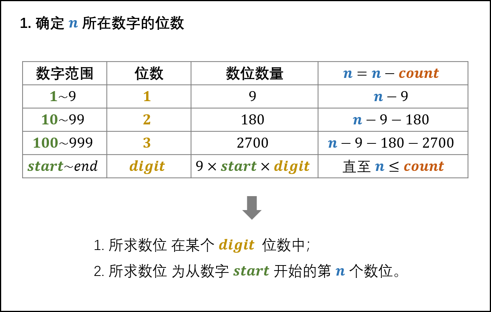
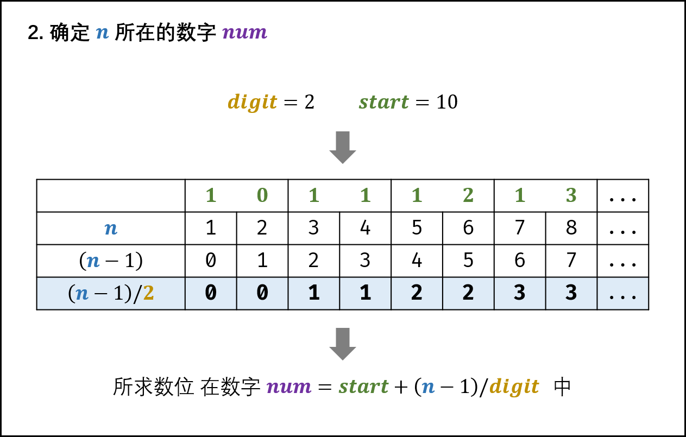

### 数字序列中某一位的数字

> 数字以0123456789101112131415…的格式序列化到一个字符序列中。在这个序列中，第5位（从下标0开始计数）是5，第13位是1，第19位是4，等等。

请写一个函数，求任意第n位对应的数字。

示例 1：

```js
// 输入：n = 3
// 输出：3
```

示例 2：

```js
// 输入：n = 11
// 输出：0
``` 


> 限制：0 <= n < 2 ^ 31

### 思路分析

根据题意，第n位对应的数字应该会与数字有对应的计算规律，让我们来推导一下。

1. 我们记 10,11,12... 中的每一位称为数位，例如1为十位，0为个位,用一个变量n来表示。
2. 我们将 10,11,12... 称为数字，用一个变量m来表示。
3. 数字 10 是一个两位数，因此，我们可以称作该数字的位数为2，用一个变量digit来表示。
4. 每 digit 位数的起始数字一定是1,10,100,1000...，用一个变量start来表示。

如下图所示:


如上图所示，我们可以推导出各digit下的数位数量用一个变量count来表示的计算公式为:

```js
count = 9 * start * digit;
```

因此，我们可以将问题求解分成三步:

1. 确定n所在数字的位数，记为digit。
2. 确定n所在的数字,记为num。
3. 确定n是num的哪一数位，并返回结果。

### 1.确定所求数位的所在数字的位数

先来看一张图:



如上图所示，我们应该就知道了，我们循环执行n -= count，直到n > count为止，此时因为n减去了digit - 1位数的数位数量count，因此，此时的n是从start开始计数的。

```js
let digit = 1,start = 1,count = 9;
while(n <= count){
    n -= count;
    start *= 10;//1,10,100,1000...
    digit += 1;//1,2,3,4...
    count = 9 * start * digit;
}
```

结论:

1. 所求数位x在某个digit位数中
2. 所求数位x为从数字start开始的第n个数位

### 2.确定所求数位所在的数字

我们再来看一张图:



如上图所示,我们就能明白所求数位x在从数字start开始的第|(n - 1) / digit|个数字中（start为第0个数字）。

```js
num = start + (n - 1) / digit;
```

结论:

1. 所求数位x在数字num中

### 3.确定所求数位在num的哪一数位

我们接着看一张图:


如上图所示,所求数位为数字num的第(n - 1) % digit位（数字的首个数位为第0位）。

```js
s = num.toString();//将数字转换成字符串
res = s[(n - 1) % digit] - '0';// - '0'可以将结果转成数值型
```

结论:

1. 所求数位是res。

我们来看一个示例:

如求第n = 15位时,

1. 确定n所在数字的数位

n - 9 = 6 > 0 -> 
继续循环 -> 
n - 9 - 180 = -171 < 0 -> 
跳出循环 -> 
可得digit = 2,start = 10 -> 
结论所求数位如下:

1.1 在某个两位数种，即digit = 2
1.2 为两位数的 start = 10 开始的第 n = 6 个数位

2. 确定n所在的数字

所求数位在数字 start = 10 起始的第 (n - 1) / digit 个数字中（从第0位开始计数） -> 
num = start + (n - 1) / digit = 10 + (6 - 1) / 2 = 12 -> 
结论所求数位如下:

2.1 所求数位在数字 num = 12 中

3. 确定n在num的哪一数位

所求数位在数字num = 12的第 (n - 1) % digit 位中（从第0位开始计数） -> 
(n - 1) % digit = 1 -> 
结论所求数位如下:

3.1 所求数位为2

详细代码如下所示:

```js
var findNthDigit = function(n){
    let digit = 1,start = 1,count = 9;
    while(n > count){
        n -= count;
        start *= 10;
        digit += 1;
        count = 9 * start * digit;
    }
    let num = start + (n - 1) / digit;
    return num.toString()[(n - 1) % digit] - '0';
}
```

时间复杂度O(log n)：所求数位 n 对应数字 num 的位数 digit 最大为 O(log n) ；第一步最多循环 O(log n) 次；第三步中将 num 转化为字符串使用 O(log n) 时间；因此总体为 O(log n) 。
空间复杂度O(log n)：将数字 num 转化为字符串 num.toString() ，占用 O(log n) 的额外空间。