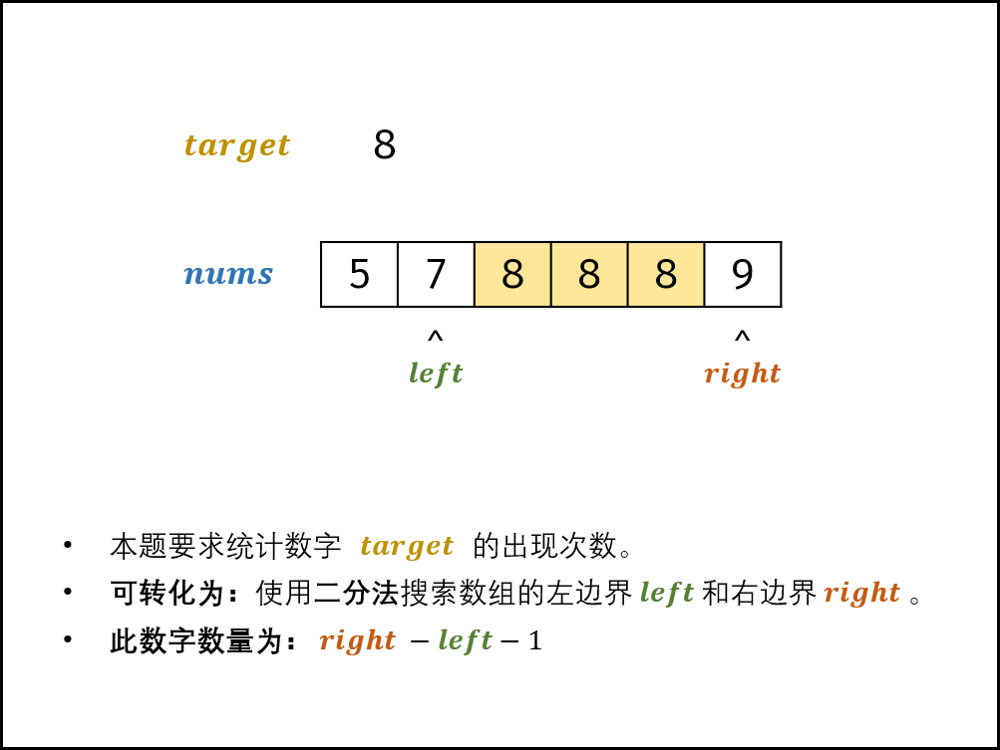
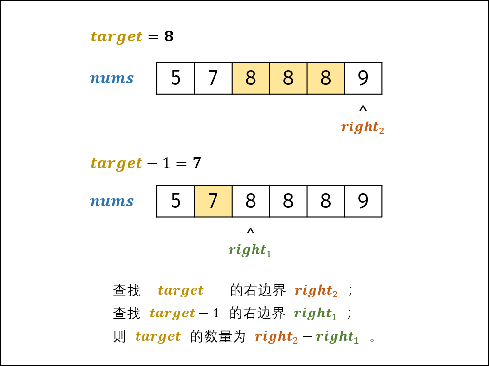

### 在排序数组中查找数字

> 题目:统计一个数字在排序数组中出现的次数。

示例1:

```js
// 输入: nums = [5,7,7,8,8,10], target = 8
// 输出: 2
```

示例2:


```js
// 输入: nums = [5,7,7,8,8,10], target = 6
// 输出: 0
```

提示:

* 0 <= nums.length <= 105
* -109 <= nums[i] <= 109
* nums 是一个非递减数组
* -109 <= target <= 109


### 思路分析

看到排序，我们应该想当然的想到二分法来解决。首先我们可以知道一个排序数组nums中的所有数字target会形成一个窗口。记窗口的左右边界索引分别为left/right，分别代表对应窗口的左边/右边的首个子元素。

本题要求统计数字target出现的次数，因此可以转化为，使用二分法分别找到左边界left和右边界right，因此可以得到数字target的出现次数为right - left -1。如下图所示:



接下来，我们来看算法的详细流程:

1. 初始化: 左边界left = 0,右边界right = nums.length - 1。
2. 循环二分: 当闭区间[i,j]无元素时，跳出循环。

   2.1 计算中点m = Math.floor(i + j) / 2;(需要向下取整)。

   2.2 若nums[i] < target,则target在闭区间[m + 1,j]中，因此执行i = m - 1。

   2.3 若nums[i] > target,则target在闭区间[i,m]中，因此执行j = m - 1。

   2.4 若nums[i] = target,则右边界right在闭区间[m + 1,j]中；左边界left在闭区间[i,m - 1]中。因此分为2种情况:

      2.4.1 若查找右边界right,则执行i = m + 1。（跳出时i指向右边界）。

      2.4.2 若查找左边界left，则执行j = m - 1。（跳出时j指向左边界）
3. 返回值: 应用两次二分，分别查找right和left，最终返回right - left - 1即可。

效率优化:

> 以下优化基于：查找完右边界right = i以后，则nums[j]指向最右边的target(若存在)

1. 查找完右边界之后，可以用nums[j] = j判断数组是否包含target。若不包含则直接返回0，无需查找右边界。
2. 查找完右边界之后，左边界left一定在区间[0,j]中，因此直接在此区间中继续二分查找即可。

```js
/**
 * @param {number[]} nums
 * @param {number} target
 * @return {number}
 */
var search = function(nums, target) {
    // 从0 ~ nums.length中开始二分查找
    let i = 0,j = nums.length - 1;
    // 定义左边界和右边界
    let right,left;
    while(i <= j){
        let m = Math.floor((i + j ) / 2);
        // 当nums[i] <= target时，i = m + 1,否则j = m - 1。
        // 此时右边界等于i
        if(nums[i] <= target){
            i = m + 1;
        }else {
            j = m - 1;
        }
    }
    right = i;
    // 如果数组中无target，则提前返回0
    if(j >= 0 && nums[j] !== target){
        return 0;
    }
    // 重置i和j，继续二分查找
    i = 0;j = nums.length - 1;
    while(i <= j){
        let m = Math.floor((i + j) / 2);
        // 当nums[i] < target时，i = m + 1,否则j = m - 1
        // 此时左边界等于j
        if(nums[i] <= target){
            i =  m + 1;
        }else{
            j = m - 1;
        }
    }
    left = j;
    // 返回right - left - 1即最终答案
    return right - left - 1;
};
```

通过分析以上代码，我们可以看到我们多写了一次二分查找。因此代码显得臃肿，所以我们需要优化一下，将代码封装在一个helper函数中。



如上图所示，由于数组中的所有元素都是整数，因此我们可以二分查找target和target - 1的右边界，然后将右边界相减并返回这个结果即可。

> 本质上看，helper函数旨在查找数字target在数组nums中的插入点，且数组中若存在值相同的元素，则插入到这些元素的右边。


```js
/**
 * @param {number[]} nums
 * @param {number} target
 * @return {number}
 */
var search = function(nums, target) {
    return helper(nums,target) - helper(nums,target - 1);
};
var helper = function(nums,target){
    let i = 0,j = nums.length - 1;
    while(i <= j){
        let m = Math.floor((i + j) / 2);
        if(nums[m] <= target){
            i = m + 1;
        }else{
            j = m - 1;
        }
    }
    return i;
}
```

时间复杂度 O(log<sup>n</sup>)： 二分法为对数级别复杂度。
空间复杂度 O(1) ： 几个变量使用常数大小的额外空间。

更多详细解题思路参考[题解](https://leetcode-cn.com/problems/zai-pai-xu-shu-zu-zhong-cha-zhao-shu-zi-lcof/solution/zai-pai-xu-shu-zu-zhong-cha-zhao-shu-zi-wl6kr/)。

